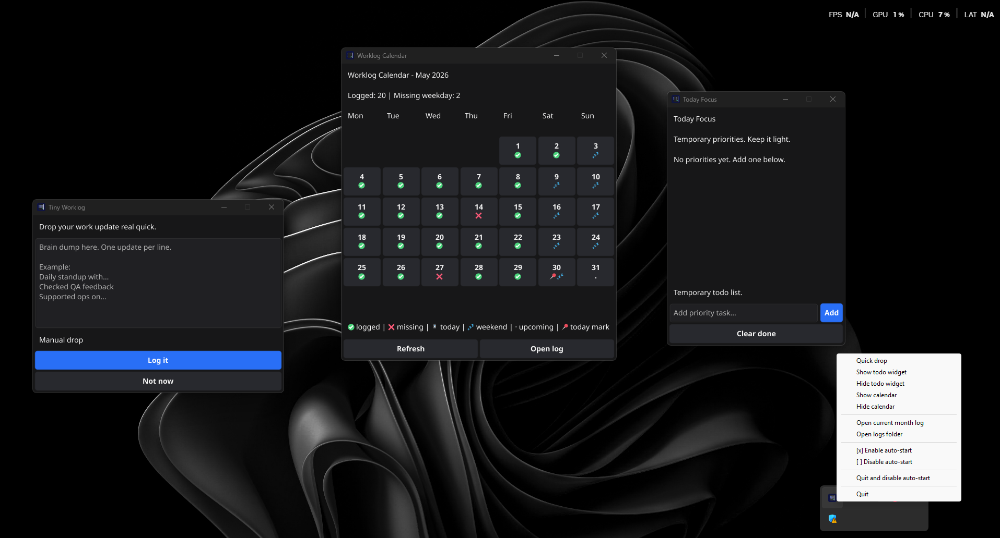

# Tiny Worklog

Tiny Worklog is a lightweight desktop app for quickly writing daily work updates, tracking short-term todo items, and reviewing monthly worklog coverage from a simple calendar view.

It is built for personal daily logging with a local-first approach. No database, no forced accounts. It operates 100% locally with an optional, seamless GitHub Cloud Sync for multi-device access.



## Download

Download the latest Windows executable from the [Releases](../../releases) page.

After downloading, run the `.exe` file directly. Tiny Worklog stores its local files next to the executable.

## Features

* Quick worklog popup for fast daily updates
* Scheduled reminders for worklog check-ins
* Monthly text file storage using `YYYYMM_daily.txt`
* Optional background GitHub synchronization (Local-First)
* Sync Console window to monitor background activities
* Clickable calendar dates to view, edit, or delete past worklogs
* System tray menu for quick actions
* Open current month log directly from the tray
* Open logs folder directly from the tray
* Windows auto-start support
* Lightweight todo widget for temporary priorities
* Persistent todo storage using `todo.json`
* Current month calendar view
* Logged day, missing weekday, weekend, today, and upcoming day indicators

## How it works

Tiny Worklog stores daily updates in monthly text files.

Example:

```txt
30/05/2026
* Daily standup with team
* Checked QA feedback
* Supported ops issue
```

The calendar reads the current month file and marks which days already have worklog entries.

## Local files

By default, files are stored next to the app executable.

```txt
logs/
  202605_daily.txt
  202606_daily.txt

todo.json
github_token.txt (optional)
```

## GitHub Cloud Sync (Optional)

Tiny Worklog supports seamless, background synchronization to a private GitHub repository.

1. Create a private GitHub repository (e.g., `my-worklog`).
2. Generate a Fine-grained Personal Access Token with "Read and write" permissions for "Contents" on that repository.
3. Create a `github_token.txt` file next to the `.exe` with the following format:
   ```text
   <your-personal-access-token>
   <your-username>/<your-repo-name>
   ```
4. The app will automatically pull logs on startup and push logs every time you save or edit an entry.
5. If the file is missing, the app continues to work 100% locally without errors.

```

## Calendar indicators

```txt
✅ logged
❌ missing weekday
⏳ today without worklog yet
💤 weekend
· upcoming day
📍 today marker
```

The calendar currently shows the current month only.

## Build from source

Build Windows executable:

```bash
mkdir -p dist
go build -trimpath -ldflags="-s -w -H windowsgui" -o dist/worklog-windows-amd64-v0.5.3.exe .
```

## Tech stack

* Go
* Fyne
* Local text file storage
* Local JSON storage

## Notes

Tiny Worklog is intended for lightweight personal work logging, not full project management.

Todo items are meant for temporary priorities, while worklogs are stored as monthly plain text files for easy access and portability.

Holiday support and richer calendar improvements may be added in future releases.
